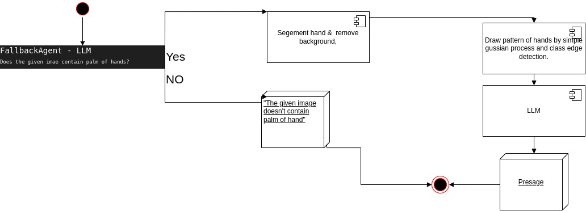
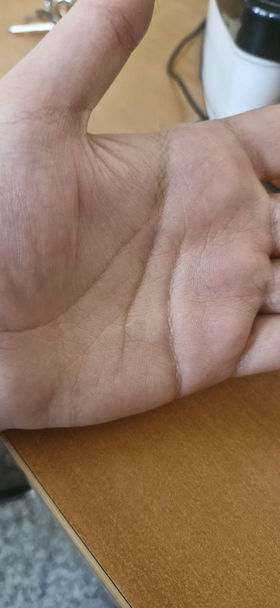
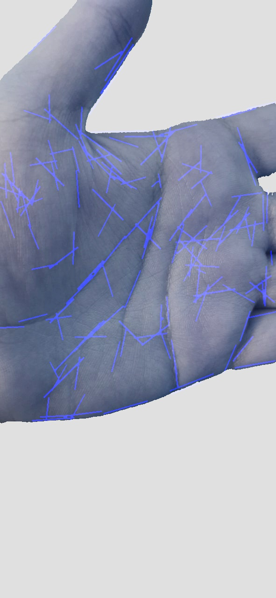

# Presage

Presage is an API-driven application utilizing **FastAPI** and **Large Language Models (LLMs)** to perform fortune-telling based on users' palm images. It leverages `llm-cpp-server` and `Lang-Segment-Anything (SAM-Lang)` to process hand images and generate insightful analyses.

## Getting Started

To run the application, follow these steps:

### Step One: Environment Setup

Create a virtual environment and install the required packages:

```bash
python3 -m venv venv
source venv/bin/activate
pip install -r requirements.txt
```

### Step Two: Model Downloads

1. **Download the LLM Model and CLIP-like Model in GGUF Format:**

   - The default LLM model is **MiniCPM-V-2_6**.
   - Rename the LLM model to `ggml.gguf` and the CLIP model to `clip.gguf`.
   - Place both models in a folder named `models` at the root of the project.

2. **Download and Install SAM-Lang:**

   ```bash
   mkdir models
   cd models
   git clone https://github.com/luca-medeiros/lang-segment-anything
   cd lang-segment-anything
   pip install -e .
   ```

## Running the Application

After completing the preparation steps, you can start the LLM server and the API server using the following command:

```bash
make run USE_GPU=false
```

This command will start both servers:

- **FastAPI server** on port **8000**
- **llm-cpp-server** on port **5333**

To run the LLM model with GPU acceleration (using half of the model layers on the GPU), use:

```bash
make run USE_GPU=true
```

> **Note:** Ensure that your system has a compatible GPU and the necessary drivers installed to utilize GPU acceleration.

## Testing the Application

To run unit tests and end-to-end tests, execute:

```bash
make test
```

This command will perform both component-level tests and full pipeline tests to ensure the application is functioning correctly.

You can now send requests to `http://localhost:8000` or use the `./run.sh` script to send a request using `curl`.

## How It Works

The following UML diagram illustrates the project's workflow:

 

1. **Validation:** The program first validates whether the provided image contains a hand.
2. **Segmentation:** It segments the hand from the image, removing other parts to improve performance for both the LLM (as the fortune teller) and the edge detector.
3. **Edge Detection:** An edge detector draws lines over the hand in the image, highlighting the palm lines.
4. **Fortune Telling:** The processed hand image is input into the LLM to generate the fortune-telling analysis.

## Result

Below is the input image & final result of the image processing:

  

At the end, the application returns a JSON response containing the fortune-telling analysis:

```json
{
  "filename": "test.jpg",
  "analysis_result": "In examining the intricate lines of this individual's hand, it appears that they possess a complex and multifaceted nature. The numerous branching patterns suggest a life filled with diverse experiences and opportunities for personal growth.\n\nLooking into their future, I see a journey marked by both challenges and triumphs. These individuals often find themselves at crossroads where decisions must be made based on intuition rather than logic alone. Their ability to navigate through these complex situations will lead them down paths they never expected but ultimately bring about greater fulfillment in life.\n\nTheir past experiences have taught them resilience, allowing them to bounce back from setbacks stronger and more knowledgeable with each passing day. As a result of this perseverance, new doors open up for exploration and adventure as their creativity blooms like an ever-expanding garden filled with possibilities waiting to be discovered.\n\nUltimately, I predict that these individuals will achieve great success by following their heart's desires while maintaining balance in all aspects of life—emotional, spiritual, intellectual, social—and continuing on this path brings happiness beyond measure."
}
```

## Tests

The testing strategy includes two approaches:

1. **Component Testing:** Each component (as depicted in the UML diagram) is individually tested to ensure it functions correctly in isolation.
2. **End-to-End Testing:** An image is selected and sent as a request to test the entire pipeline. Running `make test` executes all tests, verifying both individual components and the integrated system.

## Detailed Component Design

This document provides an in-depth narrative of the system's key components: the **Segmentor**, **Hand Lines Edge Detector**, and **LLM Agent**. Each plays a crucial role in processing images of hands to generate meaningful interpretations based on detected features. The following sections offer a detailed explanation of how these components are implemented and how they interact within the system.

### Segmentor

The **Segmentor** is designed to isolate the hand region within an image, providing a focused input for subsequent processing steps. It leverages advanced language-guided image segmentation techniques to achieve precise and accurate results.

#### Implementation Overview

- **Language-Guided Segmentation Model**: The Segmentor utilizes a model known as **LangSAM** (Language-guided Segment Anything Model). This model combines image segmentation capabilities with language prompts to direct the segmentation process.

- **Model Initialization**: Upon instantiation, the Segmentor initializes the LangSAM model configured for hierarchical segmentation tasks. This setup ensures that the model can handle complex segmentation challenges, such as separating a hand from a varied background.

- **Text Prompt Utilization**: To guide the segmentation, a textual prompt is used. By default, the prompt is set to *"Detect and segment the hand's surface"*, but it can be customized. This prompt informs the model about the specific object or region to focus on within the image.

- **Image Conversion and Preparation**: The input image is initially in a byte format. The Segmentor converts these bytes into an RGB image format, suitable for processing by the LangSAM model. This step involves decoding the image data and ensuring it is in the correct color space.

- **Segmentation Mask Prediction**: Using the image and the text prompt, the LangSAM model predicts a segmentation mask. This mask identifies which pixels in the image correspond to the hand.

- **Mask Refinement**: The predicted mask may require processing to align with expected dimensions and formats. The Segmentor ensures the mask is correctly shaped and removes any unnecessary dimensions that might interfere with applying the mask to the image.

- **Applying the Mask to the Image**: With a refined mask, the Segmentor overlays it onto the original image. This process isolates the hand by retaining the pixels within the hand region and replacing the background pixels with a uniform color (usually white). The result is an image where only the hand is visible, simplifying further analysis.

- **Output Generation**: The final product of the Segmentor is the processed image containing the segmented hand. This image is formatted appropriately for input into the next component of the system.

#### Workflow Summary

1. **Receive Image Input**: Accepts an image provided in bytes format.
2. **Initialize Segmentation Model**: Sets up the LangSAM model for use.
3. **Prepare Text Prompt**: Determines the textual instruction for segmentation.
4. **Convert Image Format**: Transforms the byte data into a usable image format.
5. **Predict Segmentation Mask**: Uses the model to identify the hand region.
6. **Refine Segmentation Mask**: Processes the mask for accurate application.
7. **Apply Mask to Image**: Isolates the hand in the image using the mask.
8. **Produce Segmented Image**: Provides the hand-only image for further processing.

### Hand Lines Edge Detector

The **Hand Lines Edge Detector** focuses on identifying and enhancing the lines present on the hand in the segmented image. These lines are essential features for generating interpretations, particularly in fields like palmistry.

#### Implementation Overview

- **Initialization with Thresholds**: The detector begins by setting thresholds for angle and distance. These thresholds are critical for determining how similar detected lines are merged later in the process, ensuring that only significant lines are highlighted.

- **Conversion to Grayscale**: The input image, which is in color, is converted to grayscale. This simplifies the image data, making it easier to process and highlighting variations in intensity that correspond to the lines on the hand.

- **Contrast Enhancement**: To make the fine lines more visible, the system enhances the image's contrast. Adaptive histogram equalization, specifically the Contrast Limited Adaptive Histogram Equalization (CLAHE) algorithm, is applied. This technique adjusts the contrast locally within regions of the image, bringing out subtle features.

- **Noise Reduction Techniques**: The image likely contains noise that can interfere with line detection. To mitigate this, noise reduction techniques are employed. Bilateral filtering preserves edges while smoothing out noise, and Gaussian blurring further reduces high-frequency variations without losing important edge information.

- **Adaptive Thresholding to Binary Image**: The enhanced and denoised image is converted into a binary image through adaptive thresholding. This process turns the grayscale image into black and white, where the lines become more distinct and can be detected more easily.

- **Morphological Operations for Line Enhancement**: Morphological transformations, such as dilation and erosion, are used to close small gaps in the lines and to connect fragmented segments. These operations enhance the continuity and prominence of the hand lines.

- **Edge Detection with Canny Algorithm**: The refined binary image undergoes edge detection using the Canny edge detector. This algorithm detects edges by looking for areas with significant intensity changes, which correspond to the lines on the hand.

- **Line Detection Using Hough Transform**: To detect straight lines within the edge-detected image, the Probabilistic Hough Line Transform is applied. This method identifies lines by looking for points in the image that align in a straight path, which is essential for highlighting significant hand lines.

- **Filtering and Selecting Lines**: The detected lines are analyzed based on their length and orientation. Lines that are too short or do not meet the specified angle thresholds are discarded. This filtering ensures that only prominent and meaningful lines are considered.

- **Merging Similar Lines**: Lines that are similar in angle and closely located are merged. This process reduces redundancy and combines line segments that actually represent a single physical line on the hand.

- **Drawing Lines on an Image**: The final set of lines is drawn onto a blank image. This step creates a visual representation of the detected hand lines, which highlights the key features for interpretation.

- **Combining with Original Image**: The image with the drawn lines is superimposed onto the original segmented hand image. This blend ensures that the lines are highlighted while preserving the natural appearance of the hand.

- **Post-Processing Adjustments**: Adjustments to brightness, contrast, and color are made to enhance the overall appearance of the image. This processed image is clearer and more detailed, making it suitable for analysis by the language model.

- **Output Generation**: The final output is an image of the hand with the significant lines highlighted and enhanced. This image captures the essential features needed for generating interpretations.

#### Workflow Summary

1. **Accept Segmented Image**: Receives the hand-only image from the Segmentor.
2. **Convert to Grayscale**: Simplifies the image data for processing.
3. **Enhance Contrast**: Makes fine lines more visible through adaptive techniques.
4. **Reduce Noise**: Applies filters to eliminate unwanted variations.
5. **Thresholding**: Converts the image to binary to isolate lines.
6. **Apply Morphological Operations**: Enhances the integrity of the lines.
7. **Detect Edges**: Identifies potential lines using edge detection.
8. **Detect Lines**: Uses line detection algorithms to find straight lines.
9. **Filter and Merge Lines**: Refines the set of lines for significance.
10. **Draw Lines on Image**: Creates a visual of the detected lines.
11. **Combine with Original Image**: Overlays lines onto the hand image.
12. **Adjust Image Properties**: Fine-tunes the image for clarity.
13. **Produce Enhanced Image**: Outputs the final image with highlighted hand lines.

### LLM Agent

The **LLM Agent** is responsible for interacting with a language model to perform high-level tasks based on the processed hand images. There are two specialized agents within this component: the **FallbackAgent** and the **PresageAgent**.

#### General Structure and Purpose

The LLM Agent functions as an interface to a language model, capable of understanding complex prompts and images. It leverages the capabilities of the model to interpret images and generate text-based outputs that align with the system's goals.

#### FallbackAgent

**Purpose**: The FallbackAgent's primary role is to verify whether the provided image contains a palm. This validation step ensures that subsequent processing is only performed on appropriate images, saving resources and preventing errors.

**Implementation Overview**:

- **System Instruction**: The agent starts by defining a system instruction that sets the context for the language model, informing it that its task is to classify images based on whether they contain a palm.

- **User Prompt Construction**: Constructs a user prompt that includes the image (encoded appropriately) and asks a specific question: whether the image consists of a palm, expecting a simple 'Yes' or 'No' response.

- **Inference Process**:

  1. **Insert Image into Prompt**: The agent embeds the base64-encoded image into the message that will be sent to the language model.

  2. **Configure Inference Parameters**: Sets parameters such as temperature (which controls randomness) and maximum tokens (which limits response length), tailored for a short, definitive answer.

  3. **Interact with Language Model**: Sends the message to the language model and waits for a response.

  4. **Process Response**: Interprets the language model's reply, which should be a simple confirmation of the presence or absence of a palm.

- **Outcome**: Based on the response, the system determines whether to proceed with further processing or to halt and possibly return an error or prompt the user for a different image.

#### PresageAgent

**Purpose**: The PresageAgent generates a creative and personalized interpretation of a person's future based on the hand image. It effectively performs a form of virtual palm reading, providing users with engaging and meaningful content.

**Implementation Overview**:

- **System Instruction**: Defines a context in which the language model acts as an assistant specializing in creative fortune-telling through hand analysis. The instruction guides the model to focus on positive and insightful interpretations without revealing any underlying technical processes.

- **User Prompt Construction**: Prepares a message that includes the processed hand image and a request for a creative interpretation.

- **Inference Process**:

  1. **Embed Hand Image**: Inserts the enhanced image with highlighted hand lines into the message for the language model.

  2. **Set Creative Parameters**: Adjusts inference settings to encourage a detailed and imaginative response. This may involve increasing the temperature to allow for more varied and creative outputs and setting a higher maximum token limit to permit longer responses.

  3. **Communicate with Language Model**: Sends the message to the language model, initiating the generation of the interpretation.

  4. **Receive and Process Response**: Collects the model's output, which should be a rich, narrative interpretation based on the features of the hand.

- **Outcome**: The agent provides the user with a thoughtful and engaging message, fulfilling the system's purpose of delivering personalized content.

#### Error Handling and Exceptions

The system incorporates robust error handling to manage any issues that may arise during image processing or model inference.

- **Custom Exception Classes**: Defines specific exception classes for different error types, such as image processing errors and model inference errors. This categorization allows for precise identification and handling of problems.

- **Graceful Degradation**: In the event of an error, the system can provide informative messages to the user or take corrective actions without crashing. This ensures a smooth user experience even when facing unforeseen challenges.

#### Overall Workflow of LLM Agent Components

1. **Validation with FallbackAgent**:

   - **Input**: Receives the initial image.
   - **Process**: Determines if the image contains a palm.
   - **Decision Point**: If yes, proceeds to the next step; if no, handles accordingly.

2. **Interpretation with PresageAgent**:

   - **Input**: Receives the enhanced image with highlighted hand lines.
   - **Process**: Generates a creative interpretation based on the image.
   - **Output**: Provides the final narrative to the user.

3. **Error Management**:

   - **Monitoring**: Continuously checks for exceptions or errors.
   - **Response**: Handles errors by informing the user or retrying processes as appropriate.

### System Integration and Data Flow

The components are designed to work sequentially, with the output of one serving as the input to the next. The data flow follows this path:

1. **Image Input**: The user provides an image, which is first validated to ensure it contains a palm.

2. **Segmentation**: The validated image is processed by the Segmentor to isolate the hand.

3. **Line Detection**: The segmented hand image is enhanced by the Hand Lines Edge Detector to highlight significant lines.

4. **Interpretation Generation**: The enhanced image is passed to the PresageAgent, which uses the language model to generate a personalized interpretation.

5. **Output Delivery**: The system presents the interpretation to the user, completing the process.


## Timeline

The project development was completed over **5 days**, divided as follows:

- **3 days:** Module programming
- **1 day:** Writing tests
- **1 day:** Writing documentation

